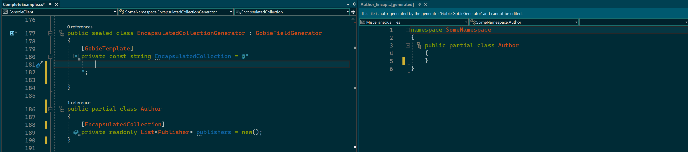

# Gobie

## Overview

  

Source generation in C# is a very powerful tool, but its complexity reduces how and where it is used. 

This is my attempt to make source generation for low/medium complexity scenarios easily accessible. Gobie allows developers define and use custom source generation without writing any generator code themselves or learning the Roslyn APIs. This happens in two steps. 
1. Devs define what they want to generate in C#. Typically this would be text templates, along with definitions for what parameters are needed to populate the template.
    1. From step 1, Gobie creates marker attributes which can be used to tag classes, fields, ... that need code generation.
2. Using the marker attributes, devs mark their code with the generated attributes, and provide custom arguments where needed. This step work just like consuming any other source generator.
    1. Code is generated based on the templates provided.

While this is in early development I'm going to keep a dev log [on my blog](https://mjconrad.com/).

## Feedback & Contribution

I am very much looking for feedback at this point. I can see several possible use cases for this approach to generation and am very interested in hearing whether others are interested in this concept or not. There are quite a few remaining technical challenges and substantial development work ahead, so it would be great to learn if this is something the community would find useful. 

Contributors are welcome, but given the early state of this project please open an issue so we can discuss anything you are interested in working on.
